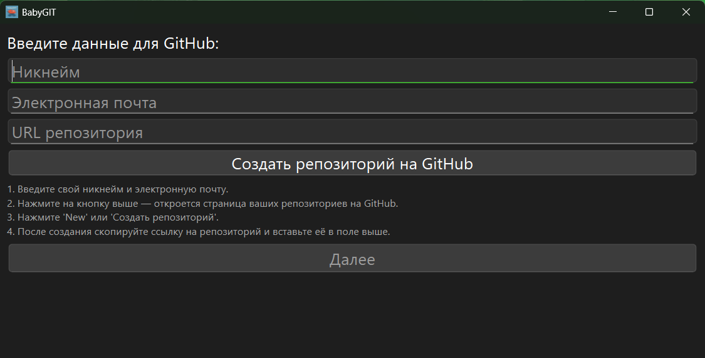
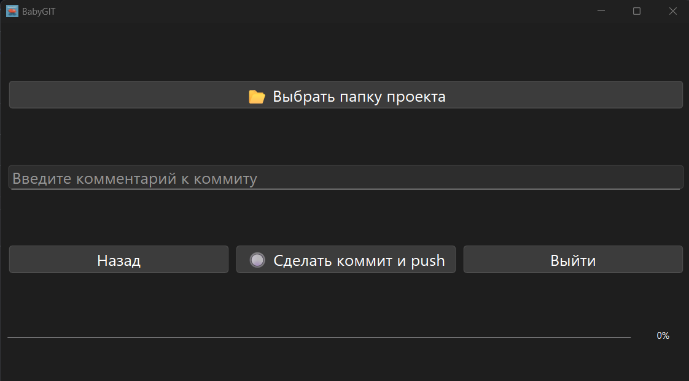
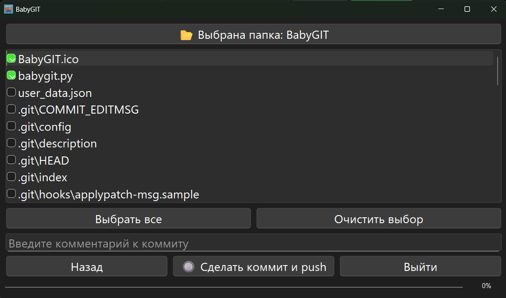

# BabyGIT


BabyGIT - это простое и удобное приложение для работы с Git и GitHub, разработанное для пользователей, которые хотят легко загружать свои проекты в GitHub репозиторий.

## Содержание

- [Обзор](#обзор)
- [Структура проекта](#структура-проекта)
- [Установка](#установка)
- [Использование](#использование)
- [Архитектура](#архитектура)
- [Технические детали](#технические-детали)
- [Скриншоты](#скриншоты)

## Обзор

BabyGIT предоставляет графический интерфейс для работы с Git и GitHub, позволяя пользователям:
- Настраивать данные GitHub (никнейм, email, URL репозитория)
- Выбирать файлы для загрузки
- Создавать коммиты и отправлять их в репозиторий
- Автоматически устанавливать Git при необходимости

## Структура проекта

```
BabyGIT/
├── babygit.py          # Основной файл приложения
├── BabyGIT.ico         # Иконка приложения
├── requirements.txt    # Зависимости проекта
└── README.md          # Документация проекта
```

## Установка

1. Убедитесь, что у вас установлен Python 3.8 или выше
2. Установите зависимости:
```bash
pip install -r requirements.txt
```

## Использование

1. Запустите приложение:
```bash
python babygit.py
```

2. На первом экране:
   - Введите свой никнейм на GitHub
   - Введите email, связанный с вашим аккаунтом GitHub
   - Введите URL вашего репозитория
   - Если у вас нет репозитория, нажмите кнопку "Создать репозиторий на GitHub"

3. На втором экране:
   - Выберите папку с проектом
   - Выберите файлы для загрузки
   - Введите комментарий к коммиту (необязательно)
   - Нажмите "Сделать коммит и push"

## Архитектура

### Основные компоненты

1. **MainWindow** - главное окно приложения
   - Управляет переключением между экранами
   - Обрабатывает пользовательский ввод
   - Сохраняет настройки пользователя

2. **GitWorker** - класс для работы с Git
   - Выполняет Git-команды в отдельном потоке
   - Обрабатывает ошибки
   - Отправляет сигналы о прогрессе

3. **GitInstaller** - класс для установки Git
   - Проверяет наличие Git
   - Устанавливает Git при необходимости
   - Работает в отдельном потоке

### Взаимодействие компонентов

```
MainWindow
    │
    ├── GitInstaller (проверка/установка Git)
    │
    ├── Screen1 (настройка GitHub)
    │   └── Сохранение настроек
    │
    └── Screen2 (работа с файлами)
        └── GitWorker (выполнение Git-команд)
```

## Технические детали

### Используемые библиотеки

- **PyQt6** - для создания графического интерфейса
- **subprocess** - для выполнения Git-команд
- **json** - для сохранения настроек
- **platform** - для определения операционной системы
- **webbrowser** - для открытия веб-страниц

### Основные классы и функции

#### MainWindow
- `__init__()` - инициализация приложения
- `init_ui()` - создание интерфейса
- `init_screen1()` - создание первого экрана
- `init_screen2()` - создание второго экрана
- `check_git_installed()` - проверка наличия Git
- `install_git()` - установка Git
- `select_folder()` - выбор папки проекта
- `make_commit()` - создание коммита

#### GitWorker
- `run()` - выполнение Git-команд
- `progress` - сигнал о прогрессе
- `finished` - сигнал о завершении

#### GitInstaller
- `run()` - установка Git
- `finished` - сигнал о завершении установки

### Точка входа

Точка входа в проект - файл `babygit.py`. При запуске создается экземпляр `QApplication` и `MainWindow`.

## Скриншоты

### Начальный экран


### Экран выбора файлов


### Завершение работы


## Особенности реализации

1. **Многопоточность**
   - Git-команды выполняются в отдельном потоке
   - Установка Git также происходит в отдельном потоке
   - Это позволяет интерфейсу оставаться отзывчивым

2. **Сохранение настроек**
   - Настройки сохраняются в JSON-файл
   - При запуске приложения настройки автоматически загружаются

3. **Автоматическая установка Git**
   - Проверка наличия Git при запуске
   - Автоматическая установка через winget на Windows
   - Резервный вариант - открытие страницы для ручной установки

4. **Выборочная загрузка файлов**
   - Возможность выбора конкретных файлов для загрузки
   - Проверка размера папки (не более 100 МБ)
   - Удобный интерфейс с чекбоксами
